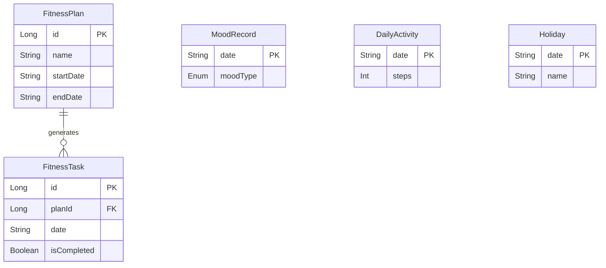

# 数据库设计文档

## 1. 概述
*   **数据库名称**: `be_healthy.db`
*   **ORM 框架**: Room (SQLite)
*   **版本**: 8
*   **说明**: 本地优先应用，所有用户数据均存储在本地 SQLite 数据库中。

## 2. 表结构 (Schema)

### 2.1 FitnessPlan (健身计划)
存储用户创建的长期或短期健身计划配置。

*   **Table Name**: `fitness_plans`

| 字段名 | 类型 | 约束 | 说明 |
| :--- | :--- | :--- | :--- |
| `id` | Long | PK, AutoInc | 计划 ID |
| `name` | String | | 计划名称 |
| `startDate` | String | | 开始日期 (YYYY-MM-DD) |
| `endDate` | String | | 结束日期 (YYYY-MM-DD) |
| `targetText` | String | | 总体目标描述 |
| `workDayDietEnabled` | Boolean | | 工作日-饮食控制开关 |
| `workDayExerciseEnabled` | Boolean | | 工作日-运动任务开关 |
| `workDayExerciseMinutes` | Int | | 工作日-目标运动时长(分) |
| `workDayExerciseSteps` | Int | | 工作日-目标步数 |
| `workDayExerciseCalories` | Int | | 工作日-目标消耗(Kcal) |
| `restDayDietEnabled` | Boolean | | 休息日-饮食控制开关 |
| `restDayExerciseEnabled` | Boolean | | 休息日-运动任务开关 |
| `restDayExerciseMinutes` | Int | | 休息日-目标运动时长 |
| `status` | Enum | | ACTIVE, INACTIVE, COMPLETED |
| `createdAt` | Long | | 创建时间戳 |

### 2.2 FitnessTask (健身任务)
根据计划自动生成的每日具体任务记录。

*   **Table Name**: `fitness_tasks`
*   **Foreign Keys**:
    *   `planId` -> `fitness_plans(id)` (ON DELETE CASCADE)
*   **Indices**:
    *   Unique Index on `(planId, date)`

| 字段名 | 类型 | 约束 | 说明 |
| :--- | :--- | :--- | :--- |
| `id` | Long | PK, AutoInc | 任务 ID |
| `planId` | Long | FK | 关联的计划 ID |
| `date` | String | | 任务日期 (YYYY-MM-DD) |
| `isCompleted` | Boolean | | 任务是否完成 |
| `actualSteps` | Int | | 实际步数 |
| `actualCalories` | Int | | 实际消耗 |
| `checkInImages` | String | | 打卡图片路径 (逗号分隔) |
| `updatedAt` | Long | | 最后更新时间 |
| *(其他饮食/运动配置字段)* | | | 继承自 Plan 的当日配置快照 |

### 2.3 MoodRecord (心情记录)
每日心情日记。

*   **Table Name**: `mood_records`

| 字段名 | 类型 | 约束 | 说明 |
| :--- | :--- | :--- | :--- |
| `date` | String | PK | 日期 (YYYY-MM-DD) |
| `moodType` | Enum | | HAPPY, SAD, ANGRY, etc. |
| `note` | String | | 文字备注 |
| `voiceNotePath` | String | | 语音备注文件路径 |
| `createdAt` | Long | | 记录时间 |

### 2.4 DailyActivity (每日活动同步)
从系统服务（Health Connect/OPPO Health）同步的汇总数据。

*   **Table Name**: `daily_activities`

| 字段名 | 类型 | 约束 | 说明 |
| :--- | :--- | :--- | :--- |
| `date` | String | PK | 日期 (YYYY-MM-DD) |
| `steps` | Int | | 总步数 |
| `calories` | Int | | 总消耗 (Kcal) |
| `distanceMeters` | Int | | 总距离 (米) |
| `durationMinutes` | Int | | 总运动时长 (分) |
| `syncedAt` | Long | | 最后同步时间戳 |

### 2.5 Holiday (节假日)
存储节假日与调休信息（用于日历显示和工作日判断）。

*   **Table Name**: `holidays`

| 字段名 | 类型 | 约束 | 说明 |
| :--- | :--- | :--- | :--- |
| `date` | String | PK | 日期 (YYYY-MM-DD) |
| `name` | String | | 节日名称 (e.g., "国庆节") |
| `type` | Int | | 1: 节假日, 2: 工作日(调休) |
| `wage` | Int | | 薪资倍数 (e.g., 3) |
| `holiday` | Boolean | | 是否放假标志 |

## 3. 数据关系图 (ER Diagram)

